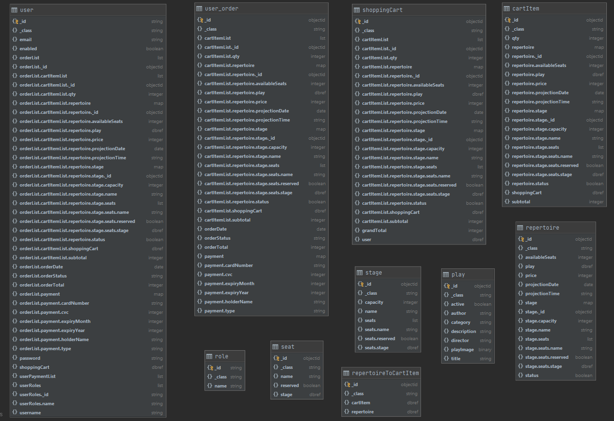
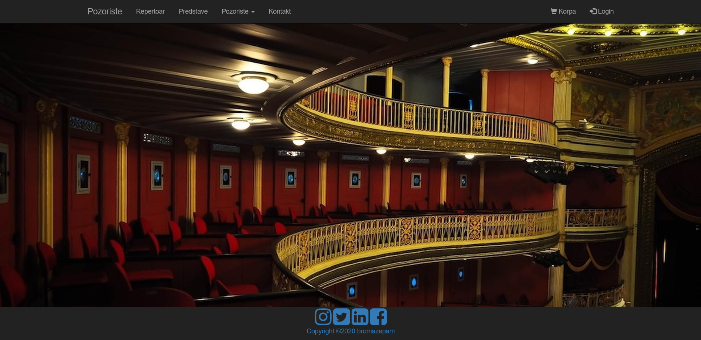

[]()

# Theater web application
This is a basic theater booking system made with [Spring Boot](http://projects.spring.io/spring-boot/).
Application runs on CircleCi.
 
 A user can SignUp, Login, manage his profile, book a seat for a play, view shopping cart,
  checkout, view history, get email confirmation...
  
 Admin user can add/alter/delete plays, stages, repertoires and print reports

## Requirements

For building and running the application you need:

- [JDK 1.8](http://www.oracle.com/technetwork/java/javase/downloads/jdk8-downloads-2133151.html)
- [Maven 4](https://maven.apache.org)
- [Lombok](https://projectlombok.org/download)
- [MongoDB](https://www.mongodb.com/)

## Running the application locally

There are several ways to run a Spring Boot application on your local machine. One way is to execute the `main` method in the `com\theater\app\AppApplication.java` class from your IDE.

Alternatively you can use the [Spring Boot Maven plugin](https://docs.spring.io/spring-boot/docs/current/reference/html/build-tool-plugins-maven-plugin.html) like so:

```shell
mvn spring-boot:run
```

By default, the app runs on port: `8080`. You can open up the admin ui from following url: `http://localhost:8080`.
Login credentials for user are: username - `user`, password - `user`, and for admin: username - `admin`, password - `admin`
 
## Packages

* 	`bootstrap` - to hold initial data;
* 	`config` - app configurations;
* 	`controller` - to listen to the client;
* 	`domain` - to hold our entities;
* 	`exceptions` - to hold custom exception handling;
* 	`repository` - to communicate with the database;
* 	`exception` - to hold custom exception handling;
*   `service` - to hold business logic and implementation
* 	`security` - security configuration;
* 	`utility` - to hold our utility classes;

* 	`resources/` - Contains all the static resources, templates and property files.
* 	`resources/reports` - Contains templates for report generation.
* 	`resources/static` - Contains static resources such as css, js and images.
* 	`resources/templates/admin` 
*   `resources/templates/user` - contains server-side templates which are rendered by Spring.
* 	`resources/templates/admin/fragments`
*   `resources/templates/user/fragments` - contains reusable code fragments.
* 	`resources/application.yml` - It contains application-wide properties. Spring reads the properties defined in this file to configure your application. You can define server’s default port, server’s context path, database URLs etc, in this file.
*   `resources/banner.txt` - Contains custom Spring Boot baner

* 	`test/` - contains unit and integration tests

* 	`pom.xml` - contains all the project dependencies

## Configuration table
 
| Components      | Technology                          |
|-----------------|-------------------------------------|
| Frontend        | Thymeleaf, Bootstrap                |
| Backend         | Spring Boot 2.4+, Java 8            |
| Security        | Spring Security, SSL                |
| Database        | MongoDB, Spring Data MongoDB        |
| Server Build    | Maven                               |
| API testing     | POSTMAN                             |
| Tools           | Intellj Idea, Robo3T, JasperReports |
| Testing         | JUnit5, Mockito                     |
| Plugins         | Lombok                              |
| Version control | Git, Github Desktop                 |
   
## Database collections diagram



## Screenshot
